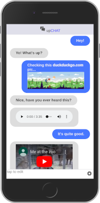

UpChat is a vanillajs code centric, browser as a platform, instant messaging client/server web application.

Featuring
    * vanillajs code centric
    * simple thin framework
    * webpack compiled
    * messaging server

    * multiple chat rooms
    * media and link urls (image, audio, video, youtube)
    * visual and audio alerts when focused away from tab
    * mobile and desktop friendly
    * supports multiple tabs

#### Setup requires two parts.
- a [client](#client-application) application
- and the [server](#backend-server) service


## Client Application

### setup
```sh
$ git clone https://github.com/technomada/chat-app.git

$ cd chat-app

$ npm i

$ cp config-EXAMPLE.js dist/config.js   ... you'll edit this file to match your server settings.
```

### build
```sh
$ npx h2js build
```

### run
```sh
$ python -m http.server --directory ./dist   (or your fav local http server)
```
Browse to: http://localhost:8000


## Backend Server

This application uses a "spaces server" to sync messages.

### install server
```sh
$ git clone https://github.com/technomada/spaces-server.git

$ cd spaces-server
$ npm i
```

### run server
```sh
$ npm start
```
(be sure to set the dist/config.js file to match your backend server address)

## Using The Application



Session A: Open the chat in a browser, click the bottom of the page, type a message and press enter to send.

Session B: On a separate device or different browser on the same device open the chat and do the same.

### change chat space
Click the gear icon in the bottom right, change the room id, click the gear again to close the settings section.

### media
The chat system supports the display of media.

#### images
paste images urls

eg https://duckduckgo.com/assets/about/hiker.svg

#### audio
paste audio urls

eg https://files.freemusicarchive.org/storage-freemusicarchive-org/music/no_curator/Lobo_Loco/Good_Old_Organ_Ice/Lobo_Loco_-_04_-_Childhood_Time_-_Long_ID_1021.mp3

#### video
paste video file urls

eg https://github.com/SPBTV/video_av1_samples/blob/master/spbtv_sample_bipbop_av1_960x540_25fps.mp4

#### youtube
paste youtube page urls.

eg https://www.youtube.com/watch?v=rDjrOaoHz9s

#### urls
eg try https://duckduckgo.com search engine.

## Distribution
Copy the contents of dist/* to a live server.

## Bonus
Add a message sound (when away from the page) create a message.mp3 audio file in the dist folder.

# Help/Next/TODO
* security
* data cycle cleaning
* review/test (iphone, edge, firefox, mobile/desktop, etc)
* favicon
* serviceworker/offline sync/push notification
